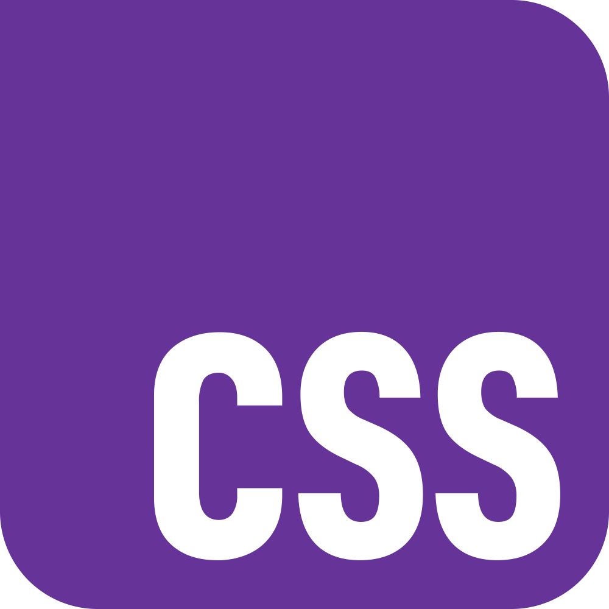
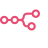

# Hi, I'm Raul 👋

I build **web products** and the systems around them, turning messy product problems into **simple, maintainable software**.

Most of my work happens somewhere between **product questions**, **interface details**, **backend behavior**, and the small technical decisions that make software easier to change later.

I've been building websites and application for 15+ years, mostly in small teams where the useful thing is rarely just _"write the code"_, but rather understanding what should exist, why it should exist, and how to make it real without making everything harder to maintain.

**Stack**

  
  
  
  
  
  
  
  
  
  
  
  
  
  
  
  
  
  
  
  
  
  
  
  
  
  
  
  
  
  
  
  
  
  
  
  
  
  
  
  
  
  
  

## Product Engineering

- I like working **close to the problem** before getting attached to a solution.
- I care about software that explains **the product**, not just the framework.
- I prefer **clear systems** over clever ones.
- I try to leave codebases **easier to understand** than I found them.

## AI-Assisted Engineering

AI is part of my everyday workflow. I use agents to **think faster**, **explore alternatives**, **review assumptions**, and tighten implementation, while keeping product context, taste, and quality judgment in the loop.

  
  
  
  
  

